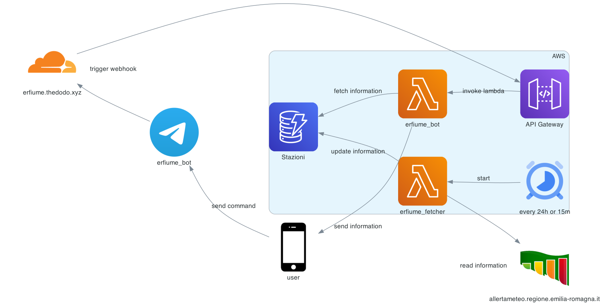

# erfiume_bot 

  

## Introduction

[`@erfiume_bot`](https://t.me/erfiume_bot) it's a Telegram bot that fetches the water levels of the rivers in Emilia Romagna. Data is retrieved from [Allerta Meteo Emilia Romagna](https://allertameteo.regione.emilia-romagna.it/) APIs and periodically stored/updated in a DynamoDB table.
The bot can be used in both private or group chats, responding to specific station names or commands.

## Basic commands:

- `/start`
- `/info`
- `/stazioni`
- `/<stazione_name>` where `<stazione_name>` is one the station reported on [Livello Idrometrico](https://allertameteo.regione.emilia-romagna.it/livello-idrometrico)

## Architecture

The bot consists of two main components:

1. **User interaction**: the code in `./app/erfiume_bot.py` is triggered by a Telegram webhook that starts an AWS Lambda function when a user interacts with the bot.
2. **Stations data update**: the code in `./app/erfiume_fetcher.py` runs on a Lambda function via an EventBridge scheduler, updating the data from the stations. This data is then used by the bot to answer to messages.

### Main technologies:

- **Pulumi** for IaC
- **AWS Lambda** for main code execution environment
- **DynamoDB** for storing station data
- **EventBridge Scheduler** to trigger the syncing from Allerta Meteo
- **teloxide** to manage Telegram inputs
- **tokio** for managing asynchronous tasks in the Lambdas
- **Levenshtein Distance** for performing fuzzy search on station names from user input

## Features

### Telegram Bot (`./app/erfiume_bot.py`)

The bot responds to Telegram messages via the main Lambda function and can:

- respond to any message or command (`/`) in private chats
- react when added to a group or supergroup
- process any command (`/`) in group or supergroup chats

What it cannot do:

- read non-command messaged in groups or supergroups
- provide [inline support](https://telegram.org/blog/inline-bots)
- support mentions

### Data fetcher (`./app/erfiume_fetcher.py`)

This Lambda function is scheduled to fetch data from the APIs on [Allerta Meteo Emilia Romagna](https://allertameteo.regione.emilia-romagna.it/) and update or create station data in a DynamoDB table. A station refers to a sensor placed on a bridge or river that monitors the water level.

The Lambda is scheduled to run once a day in "normal" mode, but in "emergency" mode, it can be set to update data every 20 minutes or less.

## Repository Structure

- **app/**: Contains the bot and fetcher code
- **pulumi/**: IaC for the AWS infrastructure

## Disclaimer

The accuracy and reliability of the data is entirely dependent on [Allerta Meteo Emilia Romagna](https://allertameteo.regione.emilia-romagna.it/). `erfiume_bot` merely collects and displays the available data from that source.
